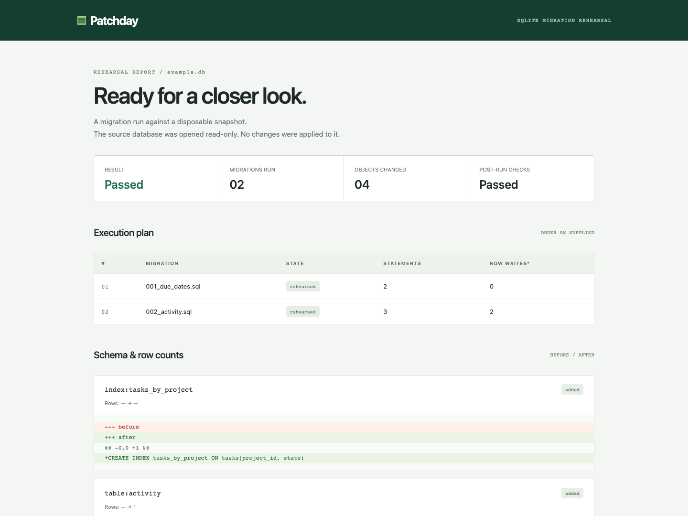

# Patchday

Rehearse SQLite migrations on a disposable snapshot before applying them elsewhere. See schema changes, row-count changes, constraint failures, and the exact migration that stopped the batch.

[Design notes](docs/design.md) · [Example report](https://miiduoa.github.io/patchday/) · [Chinook case study](docs/cases/chinook/README.md) · [繁體中文](docs/README.zh-TW.md)



## A two-minute run

Python 3.11+ with SQLite. No runtime dependencies.

```sh
python examples/seed.py example.db
python -m patchday example.db \
  examples/migrations/001_due_dates.sql \
  examples/migrations/002_activity.sql \
  --html report.html --json report.json
```

Open `report.html`. It is a self-contained report with no scripts or remote assets. The bundled data represents three fictional projects and three tasks.

To install the command in a virtual environment:

```sh
python -m venv .venv
# Activate .venv using your shell's activation command.
python -m pip install .
patchday example.db examples/migrations/001_due_dates.sql
```

## Three outcomes

| Exit | Result | Meaning |
|---|---|---|
| 0 | Passed | SQL and snapshot checks completed; no missing tables/column names or reduced row counts detected |
| 1 | Failed | A migration or database check failed; the entire rehearsal batch was rolled back |
| 2 | Input error | Invalid inputs, snapshot failure, timeout during initial inspection, or report write failure |
| 3 | Review | SQL completed, but a table/column name disappeared or a table has fewer rows |

Try `examples/broken.sql` to see a rejected NOT NULL addition. Run `examples/migrations/003_cleanup.sql` to see valid SQL that still produces **Review**. Migration files execute in the order supplied; Patchday does not maintain a migration history table or skip previously applied files.

## Isolation model

1. Open the source with SQLite `mode=ro`.
2. Use SQLite's backup API to copy a consistent snapshot, including committed WAL content, into a private in-memory database.
3. Run integrity and foreign-key checks on the starting snapshot.
4. Execute the full migration batch in one transaction with foreign keys enabled.
5. Inspect schema and row counts, check constraints, then commit only the disposable copy to exercise deferred constraints.
6. Close the copy and emit reports. There is no apply command.

`ATTACH`, `DETACH`, transaction control, savepoints, virtual-table creation/removal and extension-loading functions are blocked during migrations. PRAGMAs are blocked except read-only `quick_check`, which SQLite also invokes internally when adding a CHECK-constrained column. Remove migration-owned `BEGIN`/`COMMIT` wrappers; Patchday owns the transaction. Rehearsals time out after 10 seconds by default (`--timeout 30` to change).

Report paths must be new files. Existing files—including the source database—are never overwritten. Reports contain SQL schema text, object names and row counts, not table contents; schema literals can still be sensitive.

## What it does not establish

- Unchanged row counts do not prove unchanged values. Updates and delete/reinsert operations can escape the loss heuristic.
- Missing column names request review, including deliberate renames and generated columns. This does not establish whether their values were copied elsewhere. ASCII case-only renames do not trigger this warning.
- A passing snapshot is not a production deployment guarantee. In-memory timings do not predict disk I/O, lock contention, concurrent writes, or production migration duration.
- Large databases require memory for a full copy. There is a time budget but no hard memory sandbox.
- SQL should be trusted. The authorizer blocks common escape routes; this is not an adversarial SQL sandbox.
- Read-only SQLite access can still use/create WAL coordination sidecars. The source database is not opened for SQL writes.
- Migrations requiring other PRAGMAs, explicit transactions, virtual-table migrations and extension-dependent schemas are outside the supported scope.

## An external sample, with a counterexample

The [Chinook experiment](docs/cases/chinook/README.md) runs five migration scenarios on a checksum-pinned public music-store sample: constrained column addition, cross-file rollback, column removal, row deletion and value erasure. It exposed two bugs: populated columns could disappear with a **Passed** result, and SQLite's internal `quick_check` was denied during valid CHECK additions. Both have regression tests.

The experiment also records a remaining blind spot: setting 2,525 composer values to NULL still passes when the schema and row counts stay intact. The script asserts each observed outcome and checks that source bytes remain unchanged. Downloaded data and generated reports stay under ignored `work/`.

```sh
python experiments/chinook/run.py
```

## Verify

```sh
python -m unittest discover -s tests -v
```

31 tests cover rollback across files, source-byte preservation, WAL snapshots, deferred foreign keys, missing and renamed columns, generated/quoted/Unicode identifiers, CHECK additions, external-file escape attempts, timeouts, HTML escaping and CLI exit codes. CI runs on Ubuntu and Windows with Python 3.11, 3.13 and 3.14. The unit suite does not download Chinook.

`patchday/core.py` owns the snapshot and transaction; `patchday/report.py` renders escaped HTML; `patchday/cli.py` handles exit codes and exclusive report creation.

References: [SQLite backup API](https://www.sqlite.org/backup.html), [Python sqlite3](https://docs.python.org/3/library/sqlite3.html). MIT licensed.
