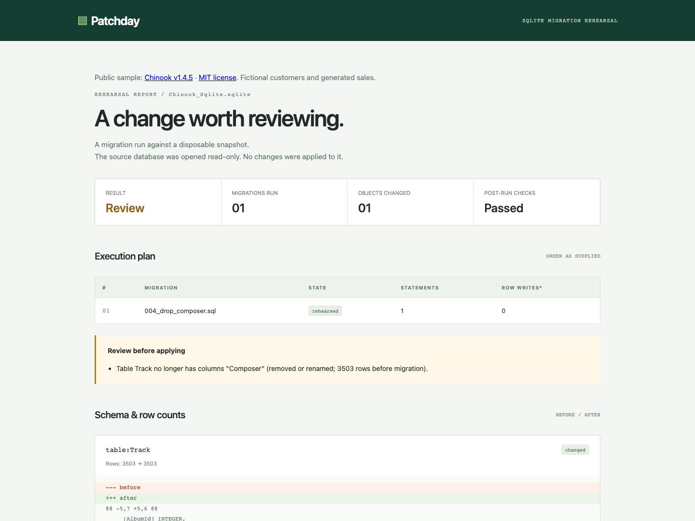

# Chinook: the rows stayed, the column did not

[Column-loss report](https://miiduoa.github.io/patchday/chinook/drop-composer.html) · [Recorded results](summary.json) · [Executable experiment](../../../experiments/chinook/run.py)



## Reproduce

From the repository root, with Python 3.11+ and SQLite 3.37+:

```sh
python experiments/chinook/run.py
```

The script downloads one public asset, verifies its byte length and SHA-256, then runs each scenario against a fresh disposable snapshot. It asserts the expected outcomes, writes five HTML/JSON reports and `summary.json` under `work/chinook/`, and checks the original file's SHA-256 after every rehearsal. Output directories must be new; to rerun without downloading again:

```sh
python experiments/chinook/run.py \
  --database work/chinook/Chinook_Sqlite.sqlite \
  --output work/chinook-rerun
```

The optional **Chinook case study** workflow runs the same script and uploads its evidence. Normal CI's 31 unit tests run without network access to this dataset.

## Source and scope

[Chinook Database v1.4.5](https://github.com/lerocha/chinook-database/releases/tag/v1.4.5), release commit `4a944a942426e1f3263fe539155fb7ef92b04b4a`; asset `Chinook_Sqlite.sqlite`, 1,067,008 bytes. SHA-256:

```text
bdf635be69850bd3be09c9a2dbeef7ddfb80036bd3ef3381383cd03b61e4a61a
```

The sample has 11 tables, including 3,503 tracks, 412 invoices and 2,240 invoice lines. Its [upstream README](https://github.com/lerocha/chinook-database/blob/4a944a942426e1f3263fe539155fb7ef92b04b4a/README.md) describes media metadata from an iTunes library, fictional customer/employee records, and generated sales. This is an external sample, not a production customer database. The [upstream MIT notice](../../../experiments/chinook/LICENSE.chinook) is retained; [source.json](../../../experiments/chinook/source.json) pins the asset and license hashes. No data is bundled in this repository.

## Observed on 2026-10-07

macOS, Python 3.14.4, SQLite 3.53.4. The checked-in [summary](summary.json) records the environment and exact outcomes; reports are observations of this run, not timing benchmarks.

| Scenario | Observed result | Evidence |
|---|---|---|
| Add invoice status with CHECK, add index, backfill | Passed | 412 row writes; final integrity and foreign-key checks pass |
| Add status, then assign an invoice to missing customer -1 | Failed | Foreign-key violation; both migration files report rollback/failure |
| Drop Track.Composer | Review | Track stays 3,503 → 3,503; missing column name is flagged |
| Delete playlist 1 membership | Review | PlaylistTrack falls 8,715 → 5,425 |
| Set every non-NULL composer to NULL | Passed | 2,525 row writes; names and counts unchanged; no loss warning |

All five runs preserved the source SHA-256. The final scenario deliberately demonstrates an undetected loss of values; a Passed result is not evidence of data equivalence.

## What changed after the experiment

At Patchday commit `72bc9c0d46990742e79791ae9ef15193c70073d1`, dropping Composer returned Passed with no risks, despite removing a column containing 2,525 non-NULL values. The row count alone did not expose it. Table snapshots now include column names from `table_xinfo`, so removed names request review. Renames, empty columns and generated columns also request review: the tool does not infer whether values survived elsewhere. ASCII case-only renames are ignored.

The constrained-column scenario exposed a second issue: SQLite invokes read-only `PRAGMA quick_check` inside ADD COLUMN, and the blanket PRAGMA restriction rejected valid SQL with `not authorized`. The authorizer now permits only that PRAGMA; configuration changes remain blocked. Tests cover valid and invalid CHECK additions and continued rejection of `foreign_keys`, `ignore_check_constraints` and `writable_schema` changes.

These results do not establish production lock behavior, migration duration, very large database performance, or value preservation. Dropping and recreating the same column name can also evade the final-state comparison.

## 繁體中文摘要

這次使用 Chinook 官方公開樣本驗證，不把虛構客戶與產生的交易稱為真實使用者資料。來源版本、commit、檔案大小、SHA-256 與 MIT 授權都固定在程式旁；執行時下載資料，完成後輸出可檢查的報告，不將資料庫放進 repo。

五個情境分別驗證正常新增／回填、跨檔案失敗回滾、刪除欄位、減少筆數，以及不會被偵測的值覆寫。最重要的發現是：刪除 Composer 時，Track 仍有 3,503 筆，舊版卻回 Passed。補上欄位名稱比較後會 Review，但改名也會要求人工檢視，因為工具不能確定資料是否搬到其他欄位。另外修正了 CHECK 新增欄位被內部 quick_check 誤擋的問題。

仍有明確限制：把 2,525 個 Composer 值改成 NULL，schema 和筆數沒變，依然 Passed。每組都驗證來源檔案雜湊不變；這份結果只證明上述樣本情境，不代表正式環境效能或每個值都被保留。
